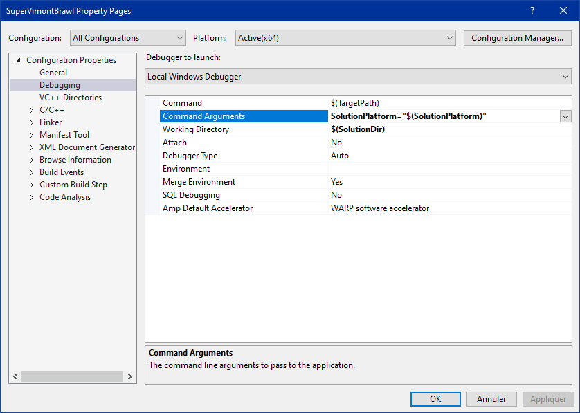

# vgframework
Yes, yet another work-in-progress game and graphic engine project :) \
Its renderer only uses modern graphics APIs like DirectX12 and Vulkan (I would also like to support Metal the day I got and Apple device) so it can be 100% bindless from the very beginning and do strong choices in that direction:  
* instanciating and writing into GPU tables is not even exposed: You have to do all the rendering stuff the modern, bindless way. 
* All the interface is made to encourage using only push constants and one dynamic "instance" buffer, not updating tables constantly as if we were still emulating DX9.
* You can't access the command lists without using the framegraph that is part of the graphic driver layer. Go framegraph or do not render anything.
* Apart from the number of root constants, all shaders are sharing the same root signatures

 
 
For the engine part, so far I integrated several "must-haves" tools like a CPU/GPU profiler, inputs, a job scheduler and Dear Imgui, and is currently implementing serialization and a basic Entity-Component system.  

Another subject that is very close to my heart is that there is a strong separation between modules as the engine is "physically" split in several DLLs using only pure abstract interfaces.
 
# external
D3D12 Memory Allocator\
https://github.com/GPUOpen-LibrariesAndSDKs/D3D12MemoryAllocator

Dear ImGui\
https://github.com/ocornut/imgui

Dirent\
https://github.com/tronkko/dirent

hlslpp\
https://github.com/redorav/hlslpp

ImGui-Addons\
https://github.com/gallickgunner/ImGui-Addons

magic_enum\
https://github.com/Neargye/magic_enum

px_sched\
https://github.com/pplux/px

stb\
https://github.com/nothings/stb

Vulkan Memory Allocator\
https://github.com/GPUOpen-LibrariesAndSDKs/VulkanMemoryAllocator

WinPixEventRuntime 1.0.200127001\
https://www.nuget.org/packages/WinPixEventRuntime

# sdk
FBX SDK 2020.0.1\
https://www.autodesk.com/developer-network/platform-technologies/fbx-sdk-2020-0  
**$(FBX_SDK)** should point to the FBX SDK installation dir *(i.e. "C:\SDK\FBX\2020.0.1")*

Vulkan SDK 1.2.148.0 (VK)\
https://vulkan.lunarg.com/sdk/home  
**$(VK_SDK_PATH)** should point the Vulkan SDK installation dir *(i.e. "C:\SDK\Vulkan\1.2.148.0")*

Win10 SDK 10.0.17763.0\
https://developer.microsoft.com/fr-fr/windows/downloads/sdk-archive/

# ide
VS Studio 2017 Community\
https://visualstudio.microsoft.com/fr/vs/older-downloads/

# optional
"Solution Configuration Name" plugin for Visual Studio 2017
https://marketplace.visualstudio.com/items?itemName=ceztko.SolutionConfigurationName

If you are using the "Solution Configuration Name" plugin you can use SolutionPlatform="$(SolutionPlatform)" in Visual Studio's command line to be able to use the DirectX12 or the Vulkan renderer by directly changing the solution platform.\
Also don't forget to set the *working directory* to **$(SolutionDir)**.

