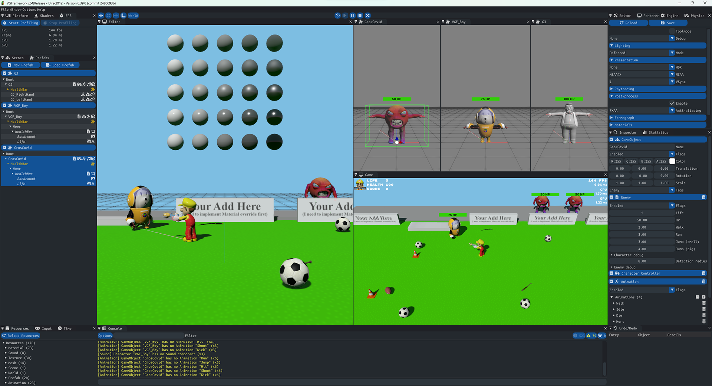
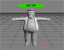
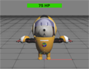

# VGFramework 0.4
Yes, yet another work-in-progress game and graphic engine project :)

| Platform | Graphics API | Debug                                                                                                                        | Release                                                                                                                          | Final 												
| -------- | ------------ | ---------------------------------------------------------------------------------------------------------------------------- | -------------------------------------------------------------------------------------------------------------------------------- | -----------------------------------------------------------------------------------------------------------------------
| ARM64EC  | DX12         |      |      | 
| ARM64EC  | Vulkan       |  |  | 
| Win64    | DX12         |          |          | 
| Win64    | Vulkan       |      |      | 

[Licence](#Licence)\
[Getting started](#Getting-started)\
[Extern libs](#Extern-libs)\
[Assets](#Assets)\
[Changelog](#Changelog)\
[Misc](#Misc)

# License

## Code

The code in this repository is licensed under the **MIT License**. Please refer to [LICENCE.md](LICENCE.md) for more details. 

External libraries referenced in the `extern` folder use permissive licenses. Please follow the provided links in the [Extern libs](#Extern-libs) section for details about the licenses used.

## Data

Most assets are using permissive licenses, while some are restricted to use only within the context of **VGFramework** development. Please refer to the [Assets](#Assets) section for more details about the licenses used.

# Getting started

You have two options depending on whether you want to build from source or use the provided executables:

## Using precompiled binaries (users)

- Run **Editor.exe** to launch the editor.
- Run **Game.exe** to start the game.

## Building from sources (programmers)

By default, VGFramework uses the precompiled binaries: Editor.exe, Game.exe, and the DLLs located in the /bin/ folder. 

When you build locally, executable files for Editor.exe and Game.exe will be created in your /build/ folder.\
The program will use these locally built files if they are present; otherwise, it will fallback to the precompiled binaries.

### To build from sources: 

- Sync the depot.
- Install the required SDKs and configure the environment variables.
- Open the "vgframework.sln" solution in Visual Studio 2022 Community IDE.
- Build & Run

**Debug** and **Release** versions will start with the editor:
Press F5 to enter game mode and F11 to maximize game view and press ESC to go back Editor mode.

**Final** versions are compiled without the editor, they will start directly in game mode and maximized.

First run might take a few seconds because files are cooking.
 
## Command-line args

| Argument		  | Type | Default	 | Description													
| --------------  | ---- | --------- | ------------------------------------------------------------- 
| attachDebugger  | bool | false	 | MessageBox at application start to let attach a debugger
| breakOnErrors   | bool | true	     | Break on graphics API errors (with **debugDevice**)
| breakOnWarnings | bool | false	 | Break on graphics API warnings (with **debugDevice**)
| debugDevice	  | bool | false (*) | Enable the graphics API debug layer	
| fullscreen	  | bool | false	 | Start application with game view maximized instead of editor	
| play			  | bool | false	 | Start application with play mode running	

(*) **debugDevice** is enabled by default on **debug** builds

## Keyboard shortcuts

| Key			   | Description	 												
| ---------------- | ------------------------------------------------------------- 
| A                | Toggle snap
| F                | Focus Selection
| H                | Toggle HDR modes (None, HDR10, HDR16)
| V                | Toggle VSync mode (None, 1 VBL, 2 VBL, 3 VBL, 4 VBL)
| UP               | Move editor camera forward
| LEFT             | Move editor camere left
| DOWN             | Move editor camera backward
| RIGHT            | Move editor camere right
| F1               | Start/stop profiler capture	
| F2               | Rename selected Object
| F6               | Hot reload shaders
| F7               | Hot reload resources				
| F5               | Enter Play mode
| Shift-F5         | Restart Play mode
| PAUSE            | Pause/resume Play mode
| F11              | Maximize Game view (fullscreen)
| ESCAPE           | Exit Play mode and go back to Editor mode
| DELETE           | Delete selected objects
| Ctrl+Mouse Wheel | Toggle Translation/Rotation/Scale gizmo
| Ctrl+D           | Duplicate selected objects (*)
| Ctrl+S           | Save
| Ctrl+U           | Save Prefab & Update
| Ctrl+Shift-Q     | Quit application

(*) You can also keep shift pressed while moving objects to duplicate

## IDE
VS Studio 2022 Community\
https://visualstudio.microsoft.com/fr/vs/community/

To compile the solution you will need the following components if they are not already installed:
- MSVC v143 - VS 2022 C++ x64/x86 build tools (latest)
- C++ ATL for latest v143 build tools (x86 & x64)

You will also need if you want to build the ARM64EC versions:
- MSVC v143 - VS 2022 C++ ARM64/ARM64EC build tools (latest)
- C++ ATL for latest v143 build tools (ARM64/ARM64EC)

Use the 'Configuration' combo to select the target and graphics API you want to use:

Also don't forget to set the *working directory* to **$(SolutionDir)**.

## SDKs

The SDKs are not included with the sources. You need to install them.

| SDK			 | Version       | URL												
| -------------- | ------------- | ------------------------------------------------------------- 
| Win10 SDK		 | 10.0.22621.0  | https://developer.microsoft.com/fr-fr/windows/downloads/sdk-archive/	
| Vulkan SDK (*) | 1.3.290.0     | https://vulkan.lunarg.com/sdk/home 

(*) Only required to build Vulkan version. **$(VULKAN_SDK)** should point the Vulkan SDK installation dir (i.e. **"C:\SDK\Vulkan\1.3.290.0"**)

# Extern libs

The external libraries are included with the sources for convenience.

| Name                       | Version       | URL                                                                       
| -------------------------- | ------------- | ------------------------------------------------------------------------- 
| D3D12 Memory Allocator     |               | https://github.com/GPUOpen-LibrariesAndSDKs/D3D12MemoryAllocator    
| D3D12 HDR Sample           |               | https://github.com/microsoft/directx-graphics-samples/tree/master/Samples/Desktop/D3D12HDR
| Dear ImGui - Docking       | 1.91.2        | https://github.com/ocornut/imgui/tree/docking                          
| DirectXShaderCompiler      | August 2023   | https://github.com/microsoft/DirectXShaderCompiler/releases/tag/v1.7.2308 
| Dirent                     | 1.23.2        | https://github.com/tronkko/dirent                                                            
| fmt                        | 10.1.1        | https://github.com/fmtlib/fmt/releases/tag/10.1.1    
| FXAA                       | 3.11          | https://github.com/GameTechDev/CMAA2/blob/master/Projects/CMAA2/FXAA/Fxaa3_11.h
| hlslpp                     | 3.5.2         | https://github.com/redorav/hlslpp/releases/tag/3.5.2                       
| IconFontCppHeaders         |               | https://github.com/juliettef/IconFontCppHeaders                                                     
| ImGuiFileDialog            | 0.6.7         | https://github.com/aiekick/ImGuiFileDialog
| ImGuizmo                   | 1.83          | https://github.com/CedricGuillemet/ImGuizmo/releases/tag/1.83             
| JoltPhysics                | 5.0.0         | https://github.com/jrouwe/JoltPhysics/releases/tag/v5.0.0                   
| meta_enum_lite             |               | https://github.com/vimontgames/meta_enum_lite         
| optick (*)                 | 1.3.1         | https://github.com/bombomby/optick                                        
| px_sched                   |               | https://github.com/pplux/px   
| SoLoud                     | August 2024   | https://github.com/jarikomppa/soloud   
| stb                        |               | https://github.com/nothings/stb                                           
| tinyXML2                   | 10.0.0        | https://github.com/leethomason/tinyxml2/releases/tag/10.0.0               
| UFBX                       | 0.14.3        | https://github.com/ufbx/ufbx                                              
| Vulkan Memory Allocator    | 3.0.1         | https://github.com/GPUOpen-LibrariesAndSDKs/VulkanMemoryAllocator         
| WinPixEventRuntime         | 1.0.231030001 | https://www.nuget.org/packages/WinPixEventRuntime                         

(*) *You can download the binaries for optick 1.3.1 from https://github.com/bombomby/optick/releases/tag/1.3.1.0*

# Assets

## Assets with usage restrictions

The assets in **these folders** are licensed under the Creative Commons Non-Commercial (CC BY-NC 4.0) License, with the additional restriction that **they may only be used within the context of VGFramework development**.

Please refer to the [ASSETS_LICENSE.md](ASSETS_LICENSE.md) for more details.

| Name		| Author                            | Files											   | Preview	
| --------- | --------------------------------- | -------------------------------------------------| ----------- 
| GJ        | [JOYxt](https://github.com/Joyxt) | data/Meshes/GJ data/Textures/GJ               |  
| VGF_Boy   | [JOYxt](https://github.com/Joyxt) | data/Meshes/VGF_Boy data/Textures/VGF_Boy     |  
| GrosCovid | [JOYxt](https://github.com/Joyxt) | data/Meshes/GrosCovid data/Textures/GrosCovid |   

## Other assets

The following assets are provided under permissive licenses. Please follow the provided links for details about those licenses:

### Fonts

| Font						 | Author        | URL												
| -------------------------- | ------------- | ------------------------------------------------------------- 
| Font-Awesome               | 6.x           | https://github.com/FortAwesome/Font-Awesome/tree/6.x   
| Rowdies                    |               | https://github.com/magictype/rowdy 
| RubikMonoOne               |               | https://fonts.google.com/specimen/Rubik+Mono+One
| UbuntuMono                 | 1.0           | https://fonts.google.com/specimen/Ubuntu+Mono

### Models

| Model				   | Author             | URL												
| -------------------- | ------------------ | ------------------------------------------------------------- 
| 3D Football          | prabath-weerapana  | https://www.cgtrader.com/free-3d-models/sports/game/3d-foot-ball
| Baseball Bat         | sepandjahrominejad | https://www.cgtrader.com/free-3d-models/military/melee/baseball-bat-5c0d0b8c-0ff9-40f8-b49d-779978a2801b
| FootBall american    | orsbone            | https://www.cgtrader.com/free-3d-models/sports/equipment/football-91c641b9-d246-4d71-a31c-d687762dd94f
| Katana samurai sword | kizaru             | https://www.cgtrader.com/free-3d-models/military/melee/katana-low-poly-59c307a4-5eaf-480d-b2a3-841d8d8c7240
| Luigi                | Anthony Yanez      | https://www.turbosquid.com/3d-models/luigi-super-model-1308288 
| Traffic Cone 	       | hinndia            | https://www.cgtrader.com/free-3d-models/exterior/street-exterior/traffic-cone-5849a434-2331-4a90-9b87-087ccc16cd0c
| Soccergoal           | NorbertVarga       | https://www.turbosquid.com/3d-models/soccergoal-3d-model-1840894

### Sound

| Sound		           | Author               | URL												
| -------------------- | -------------------- | ------------------------------------------------------------- 
| FX - Swoosh - normal | bolkmar              | https://freesound.org/people/bolkmar/sounds/451127/
| Large sword swing    | Luis0413             | https://freesound.org/people/Luis0413/sounds/737748/
| Tally Dub            | Brotheration Records | https://pixabay.com/fr/music/reggae-tally-dub-brotheration-records-2016-140287/  

### Others

Used https://github.com/Nadrin/PBR as reference for PBR lighting equations (MIT licence)

# Changelog

[Changelog](CHANGELOG.md) has been moved to a separate file.

# Misc

These tools are not mandatory but can be useful for development.

| Name				     | Description               | URL												
| ---------------------- | ------------------------- | ------------------------------------------------------------- 
| Radeon Developer Panel | GPU debugging & profiling | https://gpuopen.com/rdp/
| RenderDoc              | GPU debugging             | https://renderdoc.org/

