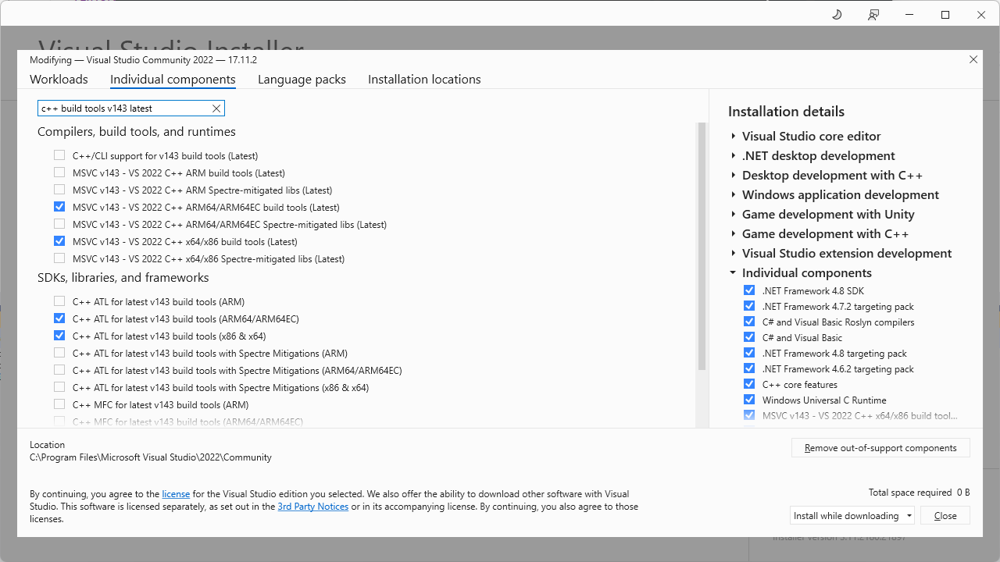
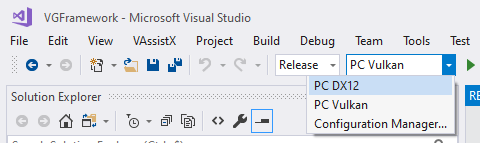



# VGFramework 0.42
Yet another work-in-progress game and graphic engine project.

# Table of contents
[Build status](#Build-Status)\
[Licence](#Licence)\
[Features](#Features)\
[Getting started](#Getting-started)\
[Extern libs](#Extern-libs)\
[Assets](#Assets)\
[Misc](#Misc)

# Build status

#### Arm64EC DX12
| Debug                                                                                                                                                       | Release                                                                                                                                                         | Final 												
| ----------------------------------------------------------------------------------------------------------------------------------------------------------- | --------------------------------------------------------------------------------------------------------------------------------------------------------------- | ----------------------------------------------------------------------------------------------------------------------------------------------------------
|      |      | 

#### Arm64EC Vulkan
| Debug                                                                                                                                                       | Release                                                                                                                                                         | Final 												
| ----------------------------------------------------------------------------------------------------------------------------------------------------------- | --------------------------------------------------------------------------------------------------------------------------------------------------------------- | ----------------------------------------------------------------------------------------------------------------------------------------------------------
|  |  | 

#### Win64 DX12
| Debug                                                                                                                                                       | Release                                                                                                                                                         | Final 												
| ----------------------------------------------------------------------------------------------------------------------------------------------------------- | --------------------------------------------------------------------------------------------------------------------------------------------------------------- | ----------------------------------------------------------------------------------------------------------------------------------------------------------
|          |          | 

#### Win64 Vulkan
| Debug                                                                                                                                                       | Release                                                                                                                                                         | Final 												
| ----------------------------------------------------------------------------------------------------------------------------------------------------------- | --------------------------------------------------------------------------------------------------------------------------------------------------------------- | ----------------------------------------------------------------------------------------------------------------------------------------------------------
|      |      | 

# License

## Code

The code in `src` folder is licensed under the **MIT License**. Please refer to [LICENCE.md](LICENCE.md) for more details. 

External libraries in the `extern` folder use permissive licenses. Please refer to the [Extern libs](#Extern-libs) section for details about the licenses used.

## Data

Most assets are using permissive licenses, while some are restricted to use only within the context of **VGFramework** development. Please refer to the [Assets](#Assets) section for more details about the licenses used.

# Features

## vg::editor
Editor GUI is implemented using Dear ImGUI.

Feature                  |  
---------------------------------------- | ------      
EditorGUI integration                    | ✅     
Support multiple editor viewports        | ✅     
Basic texture and sound preview          | ✅   
Cubemap texture preview                  | ✅     
Texture channels preview                 | ❌      

## vg::core lib
Core library shared by all projects.

Feature                  |  
---------------------------------------- | ------      
Serialize objects to/from XML & binary   | ✅     
Autodetect memory leaks                  | ✅     
Error/Warning/Info runtime log           | ✅     
CPU & GPU profiler integration           | ✅   
Cross-DLL shared singletons              | ✅   

## vg::engine
Engine dynamic library.

Feature                  |  
---------------------------------------- | ------    
Windows 64-bits support                  | ✅  
Windows 11 on ARM support                | ✅  
Linux support                            | ❌ 
Mac support                              | ❌ 
Amiga support                            | ❌ 
Cooking and sharing resources            | ✅     
Reimport modified resources              | ✅     
GameObject/Components system             | ✅     
Prefabs & nested prefabs                 | ✅     
Jobs scheduler using px_shed             | ✅     

## vg::gfx
Low-level cross-API interface for graphics.

Feature                  |  
---------------------------------------- | ------     
DirectX12 backend                        | ✅     
Metal backend                            | ❌     
Vulkan backend                           | ✅     
PIX performance markers                  | ✅     
Compressed texture formats support       | ❌     
Compress meshes at import                | ❌     
Precompiled PSOs                         | ❌  
Exclusive fullscreen                     | ❌  

## vg::renderer
Renderer dynamic library implemented using the cross-API vg::gfx library.

Feature                  |  
---------------------------------------- | ------       
MSAA & FXAA                              | ✅     
Deferred & forward shading               | ✅     
Shadow maps and raytraced shadows        | ✅  
Diffuse & specular environment maps      | ✅ 
Inline ray tracing pipeline              | ✅     
Import meshes & animations using UFBX    | ✅     
Import textures using stb_image          | ✅     
Drive Dear ImGUI using Components/Canvas | ✅    
Realtime global illumination             | ❌   
Configurable post-processing pipeline    | ❌   
Terrain engin                            | ❌  

## vg::physics
Physics engine implemented using the Jolt library.

Feature                  |  
---------------------------------------- | ------      
Physics engine integration               | ✅     
Rigid static & dynamic bodies            | ✅     
Jolt character controller                | ✅     
Ragdolls system                          | ❌ 

## vg::sound
Sound engine implemented using the SoLoud library.

Feature                  |  
---------------------------------------- | ------      
Sound engine integration                 | ✅   
Spatialized sounds                       | ❌  

# Getting started

You have two options depending on whether you want to build from source or use the provided executables:

## Using precompiled binaries (users)

- Run `Editor.exe` to launch the editor.
- Run `Game.exe` to start the game.

## Building from sources (programmers)

By default, VGFramework uses the precompiled binaries: `Editor.exe`, `Game.exe`, and the DLLs located in the `bin/` folder. 

When you build locally, executable files will be created in your `build/` folder.\
The program will use these locally built files if they are present; otherwise, it will fallback to the precompiled binaries.

### To build from sources: 

- Sync the depot.
- Install the required SDKs and configure the environment variables.
- Open the `vgframework.sln` solution in Visual Studio 2022 Community IDE.
- Build & Run

**Debug** and **Release** versions will start with the editor:
Press `F5` to enter game mode and `F11` to maximize game view and press `ESC` to go back Editor mode.

**Final** versions are compiled without the editor, they will start directly in game mode and maximized.

First run might take a few seconds because files are cooking.
 
## Command-line args

| Name| Description													
| ------------------- | ------------------------------------------------------------- 
| `attachDebugger`    | MessageBox at application start to let attach a debugger
| `breakOnErrors`     | Break on graphics API errors (with **debugDevice**)
| `breakOnWarnings`   | Break on graphics API warnings (with **debugDevice**)
| `debugDevice`	      | Enable the graphics API debug layer ✨
| `fullscreen`	      | Start application with game view maximized instead of editor	
| `play`		      | Start application with play mode running	
                      
✨ **debugDevice** is enabled by default on **debug** builds

## Keyboard shortcuts

| Name| Description		 												
| ------------------- | ------------------------------------------------------------- 
| `A`                 | Toggle snap
| `F`                 | Focus Selection
| `H`                 | Toggle HDR modes (None, HDR10, HDR16)
| `V`                 | Toggle VSync mode (None, 1 VBL, 2 VBL, 3 VBL, 4 VBL)
| `UP`                | Move editor camera forward
| `LEFT`              | Move editor camere left
| `DOWN`              | Move editor camera backward
| `RIGHT`             | Move editor camere right
| `F1`                | Start/stop profiler capture	
| `F2`                | Rename selected Object
| `F6`                | Hot reload shaders
| `F7`                | Hot reload resources				
| `F5`                | Enter Play mode
| `Shift-F5`          | Restart Play mode
| `PAUSE`             | Pause/resume Play mode
| `F11`               | Maximize Game view (fullscreen)
| `ESCAPE`            | Exit Play mode and go back to Editor mode
| `DELETE`            | Delete selected objects
| `Ctrl+Mouse Wheel`  | Toggle Translation/Rotation/Scale gizmo
| `Ctrl+D`            | Duplicate selected objects ✨
| `Ctrl+S`            | Save
| `Ctrl+U`            | Save Prefab & Update
| `Ctrl+Shift-Q`      | Quit application

✨ You can keep **shift** pressed while moving objects to duplicate them.

## IDE
VS Studio 2022 Community\
https://visualstudio.microsoft.com/fr/vs/community/

To compile the solution you will need the following components if they are not already installed:
- MSVC v143 - VS 2022 C++ x64/x86 build tools (latest)
- C++ ATL for latest v143 build tools (x86 & x64)

You will also need if you want to build the ARM64EC versions:
- MSVC v143 - VS 2022 C++ ARM64/ARM64EC build tools (latest)
- C++ ATL for latest v143 build tools (ARM64/ARM64EC)

Use the 'Configuration' combo to select the target and graphics API you want to use:

Also don't forget to set the *working directory* to **$(SolutionDir)**.

## SDKs

The SDKs are not included with the sources. You need to install them.

| Name 			                                                    | Version        
| --------------------------------------------------------------------------------- | -------------  
| [Win10 SDK](https://developer.microsoft.com/fr-fr/windows/downloads/sdk-archive/) | 10.0.22621.0
| [Vulkan SDK](https://vulkan.lunarg.com/sdk/home) ✨                               | 1.3.290.0 

✨ Only required to build Vulkan version. **$(VULKAN_SDK)** should point the Vulkan SDK installation dir (e.g., `C:\SDK\Vulkan\1.3.290.0`).

# Extern libs

The external libraries are included with the sources for convenience. Follow the link for details about the licence used.

| Name 			                                                                                        | Version    
| --------------------------------------------------------------------------------------------------------------------- | ------------- 
| [D3D12 Memory Allocator](  https://github.com/GPUOpen-LibrariesAndSDKs/D3D12MemoryAllocator                           )    |               
| [D3D12 HDR Sample](        https://github.com/microsoft/directx-graphics-samples/tree/master/Samples/Desktop/D3D12HDR )    |               
| [Dear ImGui](              https://github.com/ocornut/imgui/tree/docking                                              )    | 1.91.2                          
| [DirectX Shader Compiler]( https://github.com/microsoft/DirectXShaderCompiler/releases/tag/v1.7.2308                  )    | August 2023    
| [Dirent](                  https://github.com/tronkko/dirent                                                          )    | 1.23.2                                                                   
| [fmt](                     https://github.com/fmtlib/fmt/releases/tag/10.1.1                                          )    | 10.1.1            
| [FXAA](                    https://github.com/GameTechDev/CMAA2/blob/master/Projects/CMAA2/FXAA/Fxaa3_11.h            )    | 3.11           
| [hlslpp](                  https://github.com/redorav/hlslpp/releases/tag/3.5.3                                       )    | 3.5.3                              
| [IconFont CppHeaders](     https://github.com/juliettef/IconFontCppHeaders                                            )    |                                                                     
| [ImGuiFileDialog](         https://github.com/aiekick/ImGuiFileDialog                                                 )    | 0.6.7          
| [ImGuizmo](                https://github.com/CedricGuillemet/ImGuizmo/releases/tag/1.83                              )    | 1.83                       
| [JoltPhysics](             https://github.com/jrouwe/JoltPhysics/releases/tag/v5.0.0                                  )    | 5.0.0                            
| [meta_enum_lite](          https://github.com/vimontgames/meta_enum_lite                                              )    |                       
| [optick](                  https://github.com/bombomby/optick                                                         ) ✨ | 1.3.1                                                  
| [px_sched](                https://github.com/pplux/px                                                                )    |                
| [SoLoud](                  https://github.com/jarikomppa/soloud                                                       )    | August 2024    
| [stb](                     https://github.com/nothings/stb                                                            )    | 2.30                                                          
| [tinyXML2](                https://github.com/leethomason/tinyxml2/releases/tag/10.0.0                                )    | 10.0.0                     
| [UFBX](                    https://github.com/ufbx/ufbx                                                               )    | 0.14.3                                                      
| [Vulkan Memory Allocator]( https://github.com/GPUOpen-LibrariesAndSDKs/VulkanMemoryAllocator                          )    | 3.0.1                   
| [WinPixEventRuntime](      https://www.nuget.org/packages/WinPixEventRuntime                                          )    | 1.0.231030001                    

✨ You can download the binaries for optick 1.3.1 from https://github.com/bombomby/optick/releases/tag/1.3.1.0

# Assets

## Assets with usage restrictions

The assets in **the following folders** are licensed under the Creative Commons Non-Commercial (CC BY-NC 4.0) License, with the additional restriction that **they may only be used within the context of VGFramework development**.

Please refer to the [ASSETS_LICENSE.md](ASSETS_LICENSE.md) for more details.

| Asset folders						   | Author                            
| ---------------------------------------------------- | --------------------------------- 
| `data/Meshes/GJ` `data/Textures/GJ`               | [JOYxt](https://github.com/Joyxt)  
| `data/Meshes/VGF_Bo` `data/Textures/VGF_Boy`      | [JOYxt](https://github.com/Joyxt) 
| `data/Meshes/GrosCovid` `data/Textures/GrosCovid` | [JOYxt](https://github.com/Joyxt)  

## Other assets

The following assets are provided under permissive licenses. Please follow the provided links for details about those licenses:

### Fonts

| Name                                                   | Info 											
| ---------------------------------------------------------------------- | -------------
| [Font-Awesome]( https://github.com/FortAwesome/Font-Awesome/tree/6.x ) | 6.x   
| [Rowdies](      https://github.com/magictype/rowdy                   ) |      
| [RubikMonoOne]( https://fonts.google.com/specimen/Rubik+Mono+One     ) |      
| [UbuntuMono](   https://fonts.google.com/specimen/Ubuntu+Mono        ) | 1.0  

### Models

| Name                                                                                                                         | Info								
| -------------------------------------------------------------------------------------------------------------------------------------------- | ------------------------------------------------------------- 
| [3D Football](          https://www.cgtrader.com/free-3d-models/sports/game/3d-foot-ball                                                   ) | prabath-weerapana
| [Baseball Bat](         https://www.cgtrader.com/free-3d-models/military/melee/baseball-bat-5c0d0b8c-0ff9-40f8-b49d-779978a2801b           ) | sepandjahrominejad
| [FootBall american](    https://www.cgtrader.com/free-3d-models/sports/equipment/football-91c641b9-d246-4d71-a31c-d687762dd94f             ) | orsbone             
| [Katana samurai sword]( https://www.cgtrader.com/free-3d-models/military/melee/katana-low-poly-59c307a4-5eaf-480d-b2a3-841d8d8c7240        ) | kizaru              
| [Luigi](                https://www.turbosquid.com/3d-models/luigi-super-model-1308288                                                     ) | Anthony Yanez       
| [Traffic Cone](         https://www.cgtrader.com/free-3d-models/exterior/street-exterior/traffic-cone-5849a434-2331-4a90-9b87-087ccc16cd0c ) | hinndia             
| [Soccergoal](           https://www.turbosquid.com/3d-models/soccergoal-3d-model-1840894                                                   ) | NorbertVarga        

### Environment maps

| Name                                                                                      | Info 	            											
| --------------------------------------------------------------------------------------------------------- | ------------------- 
| [Free HDR Map 779](     https://hdri-skies.com/free-hdris/hdr-map-779/           )                        | [hdri-skies.com](hdri-skies.com)               

### Sounds

| Name                                                                                      | Info 	            											
| --------------------------------------------------------------------------------------------------------- | ------------------- 
| [FX - Swoosh - normal]( https://freesound.org/people/bolkmar/sounds/451127/                             ) | bolkmar               
| [Large sword swing](    https://freesound.org/people/Luis0413/sounds/737748/                            ) | Luis0413              
| [Tally Dub](            https://pixabay.com/fr/music/reggae-tally-dub-brotheration-records-2016-140287/ ) | Brotheration Records   
| [Chainsaw](             https://freesound.org/people/pblzr/sounds/512875/                               ) | [pblzr](https://freesound.org/people/pblzr/)

# Misc

These tools are not mandatory but can be useful for development.

| Name                                 | Info              
| ---------------------------------------------------- | ------------------------- 
| [Radeon Developer Panel]( https://gpuopen.com/rdp/ ) | GPU debugging & profiling 
| [RenderDoc](              https://renderdoc.org/   ) | GPU debugging 
