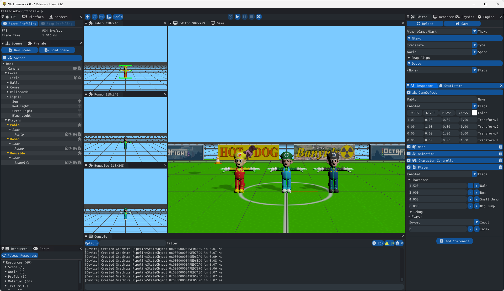
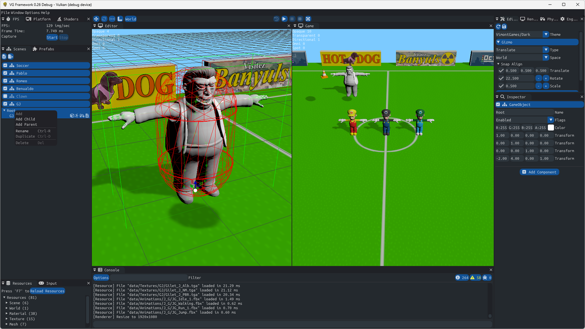
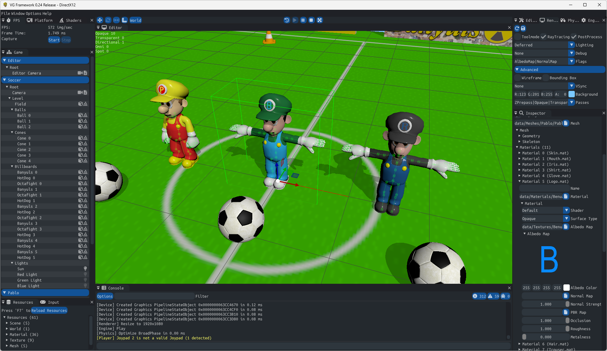
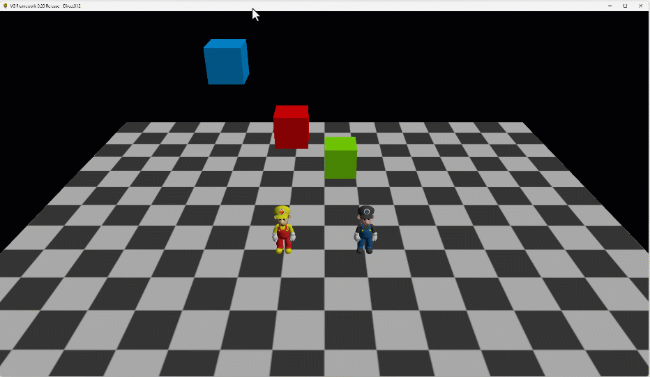

# vgframework
Yes, yet another work-in-progress game and graphic engine project :)

[build](#build)\
[changelog](#changelog)\
[getting started](#getting-started)\
[extern libs](#extern-libs)\
[disclaimer](#disclaimer)

# build
| Configuration	  | Platform  | API       | Status 												
| --------------  | --------- | --------- | ------ 
| Debug           | PC        | DirectX12 | 
| Release         | PC        | DirectX12 | 
| Debug           | PC        | Vulkan    | 
| Release         | PC        | Vulkan    | 

Its renderer only uses modern graphics APIs like DirectX12 and Vulkan (I would also like to support Metal the day I got and Apple device) so it can be 100% bindless from the very beginning and do strong choices in that direction:  
* instanciating and writing into GPU tables is not even exposed: You have to do all the rendering stuff the modern, bindless way. 
* All the interface is made to encourage using only push constants and bindless buffers/textures, not updating tables constantly as if we were still emulating DX9.
* You can't access the command lists without using the framegraph that is part of the graphic driver layer. Go framegraph or do not render anything.
* Apart from the number of root constants, all shaders are sharing the same root signatures.

For the engine part, so far I integrated several "must-haves" tools like a CPU/GPU profiler, inputs, a job scheduler and Dear Imgui. I am currently implementing an Entity/Component system and reflection using ImGui.  

Another subject that is very close to my heart is that there is a strong separation between modules as the engine is "physically" split in several DLLs using only pure abstract interfaces.

# changelog

## 0.27 "Let it snow"
Can now create **Prefabs** to instanciate in Levels

## 0.26 "Yellow Zombie"
Editor Camera V0\
Improve window resize + fix rare crash when maximizing window\
Forbid deleting or adding siblings to root node\
Better leak tracking with __FILE__ and __LINE__ + Fix rare memory leak in animation loading\
Update WinPixEventRuntime 1.0.231030001

## 0.25 "Freaky Clown"
Fix an issue with **CountLeadingZeroes** that could return a different result depending on CPU used\
Jolt no more uses **AVX2** to allow running on older hardware\
VGFramework requires **AVX1** available on any AMD/Intel CPU since 2011 (Bulldozer/Sandy Bridge)\
Patch shader files in memory to support GPU DebugInfo/Warning/Error/Assert\
Fix non-triangulated mesh import

## 0.24 "Kasper"
New darker ImGui style\
Read instance color and texture from GPUInstanceData and GPUMaterialData\
Improve BLAS management\
Transparent pass\
Lock-free multithreaded debug display

## 0.23
Directional and spot lights with Raytraced (hard) shadows

## 0.22
Skinned BLAS updates for RT\
Add icons for component types\
Depth/Stencil Shader Resource Views\
Fix Vulkan RenderDoc capture crash because of RayTracing used in bindless root signature

## 0.21
Add support for inline RayTracing with BLAS & TLAS for DirectX12/Vulkan\
Duplicate/Instanciate GameObjects hierarchies UI\
Log shader and PSO compilation timings\
Optimize physics broadphase when game starts\
Use float for dt instead of double\
Optimized DirectX12 clear color\
Fix multithread issue in Resource window when hot-reloading\
Variable map/unmap size to speed up skinning\
Update Vulkan Memory Allocator to 3.0.1\
Update hlslpp to 3.4

## 0.20
Translate/Move/Rotate objects using ImGuizmo\
Character Controller component\
Start in Game mode, not editor

## 0.17
New add/remove component buttons and improved components popup windows
Add support for themes

## 0.16
JoltPhysics integration V0

## 0.15
**Removed dependency to the FBX SDK**

## 0.14
Skeletal animations with Compute Shader Skinning\
Modified properties are restored when exiting Game mode\
Application now has icon :p

## 0.13
Loaded resources are displayed per type and their owners with paths

## 0.12
Mesh (FBX), Material & Texture hot-reload\
GPU Picking

## 0.11
Add Info/Warning/Error console + clean & fixes

## 0.1
Separate DLLs for Engine, Renderer, Editor and Game.

# getting started

- Sync the depot.
- Install the required SDKs and configure the environment variables.
- Open the "vgframework.sln" solution in Visual Studio 2022 Community IDE.
- Build & Run
 
You can double-click "Play (DX12).bat" or "Play (Vulkan).bat" to start the game sample without editor.\
In game you can press ESC at any time to go back Editor mode.\
First run might take a few seconds because files are cooking.
 
## command-line args

| Argument		  | Type | Default	 | Description													
| --------------  | ---- | --------- | ------------------------------------------------------------- 
| attachDebugger  | bool | false	 | MessageBox at application start to let attach a debugger
| breakOnErrors   | bool | true	     | Break on graphics API errors (with **debugDevice**)
| breakOnWarnings | bool | false	 | Break on graphics API warnings (with **debugDevice**)
| debugDevice	  | bool | false (*) | Enable the graphics API debug layer	
| fullscreen	  | bool | false	 | Start application with game view maximized instead of editor	
| play			  | bool | false	 | Start application with play mode running	

(*) **debugDevice** is enabled by default on **debug** builds

## keyboard shortcuts

| Key			| Description	 												
| ------------- | ------------------------------------------------------------- 
| F1			| Start/stop profiler capture	
| F2			| Rename selected Object
| F6			| Hot reload shaders
| F7			| Hot reload resources				
| F5			| Enter Play mode
| Shift-F5		| Restart Play mode
| PAUSE			| Pause/resume Play mode
| F11			| Maximize Game view (fullscreen)
| ESCAPE		| Exit Play mode and go back to Editor mode
| DELETE		| Delete selected objects
| Ctrl-D		| Duplicate selected objects (*)
| Ctrl-Q		| Quit application
| Ctrl-T		| Translation gizmo
| Ctrl-R		| Rotation gizmo
| Ctrl-S		| Scale gizmo

(*) You can also keep shift pressed while moving objects to duplicate

## ide
VS Studio 2022 Community\
https://visualstudio.microsoft.com/fr/vs/community/

During the install select *"Desktop development with C++"* and *"MSVC v143 - VS 2022 C++ x64/x86 build tools (latest)"* (or add them later from *Tool>Get Tools and Features...*)

You can change the Solution Platform in Visual Studio's command line to toggle between the DirectX12 and the Vulkan renderers.

Also don't forget to set the *working directory* to **$(SolutionDir)**.

## SDKs

The SDKs are not included with the sources. You need to install them.

| SDK			 | Version       | URL												
| -------------- | ------------- | ------------------------------------------------------------- 
| Win10 SDK		 | 10.0.22621.0  | https://developer.microsoft.com/fr-fr/windows/downloads/sdk-archive/	
| Vulkan SDK (*) | SDK 1.3.261.1 | https://vulkan.lunarg.com/sdk/home 

(*) Only required to build Vulkan version. **$(VK_SDK_PATH)** should point the Vulkan SDK installation dir (i.e. **"C:\SDK\Vulkan\1.3.261.1"**)

# extern libs

The external libraries are included with the sources for convenience.

| Name                       | Version       | URL                                                                       | Licence
| -------------------------- | ------------- | ------------------------------------------------------------------------- | ------- 
| D3D12 Memory Allocator     |               | https://github.com/GPUOpen-LibrariesAndSDKs/D3D12MemoryAllocator          | MIT    
| Dear ImGui                 |               | https://github.com/ocornut/imgui/commits/docking                          | MIT    
| DirectXShaderCompiler      | August 2023   | https://github.com/microsoft/DirectXShaderCompiler/releases/tag/v1.7.2308 | MIT    
| Dirent                     |               | https://github.com/tronkko/dirent                                         | MIT    
| Font-Awesome               | 6.x           | https://github.com/FortAwesome/Font-Awesome/tree/6.x                      | MIT    
| fmt                        | 10.1.1        | https://github.com/fmtlib/fmt/releases/tag/10.1.1                         | MIT    
| hlslpp                     | 3.4           | https://github.com/redorav/hlslpp/releases/tag/3.4                        | MIT    
| IconFontCppHeaders         |               | https://github.com/juliettef/IconFontCppHeaders                           | MIT    
| ImGui-Addons               |               | https://github.com/gallickgunner/ImGui-Addons                             | MIT    
| ImGuizmo                   | 1.83          | https://github.com/CedricGuillemet/ImGuizmo/releases/tag/1.83             | MIT    
| JoltPhysics                | 4.0.1         | https://github.com/jrouwe/JoltPhysics/releases/tag/v4.0.1                 | MIT    
| magic_enum                 | 0.9.4         | https://github.com/Neargye/magic_enum                                     | MIT    
| optick (*)                 | 1.3.1         | https://github.com/bombomby/optick                                        | MIT    
| px_sched                   |               | https://github.com/pplux/px                                               | MIT    
| stb                        |               | https://github.com/nothings/stb                                           | MIT    
| tinyXML2                   | 10.0.0        | https://github.com/leethomason/tinyxml2/releases/tag/10.0.0               | zlib    
| UFBX                       |               | https://github.com/ufbx/ufbx                                              | MIT    
| Vulkan Memory Allocator    | 3.0.1         | https://github.com/GPUOpen-LibrariesAndSDKs/VulkanMemoryAllocator         | MIT    
| WinPixEventRuntime         | 1.0.231030001 | https://www.nuget.org/packages/WinPixEventRuntime                         | MIT    

(*) *You can download the binaries for optick 1.3.1 from https://github.com/bombomby/optick/releases/tag/1.3.1.0*

# data
## models

| Model						    | URL												
| ----------------------------- | ------------------------------------------------------------- 
| Luigi						    | https://www.turbosquid.com/3d-models/luigi-super-model-1308288 
| 3D Foot Ball Free low-poly 3D | https://www.cgtrader.com/free-3d-models/sports/game/3d-foot-ball
| Traffic Cone Free 3D model	| https://www.cgtrader.com/free-3d-models/exterior/street-exterior/traffic-cone-5849a434-2331-4a90-9b87-087ccc16cd0c

# misc

Used https://github.com/Nadrin/PBR as reference for PBR lighting equations (MIT licence)

# disclaimer
Everything is heavily "Work-in-Progress" and 0% in an usable state, and I would not recommend anyone to use it yet.
