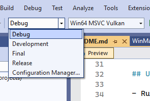

# VGFramework 0.53
VGFramework is a pet game engine for fun, modern graphics APIs, and fast iteration.


# Table of contents
[Build status](#Build-Status)\
[Getting started](#Getting-started)\
[Licence](#Licence)\
[Extern libs](#Extern-libs)\
[Assets](#Assets)\
[Misc](#Misc)

# Build status

| Configuration        | &nbsp;&nbsp;&nbsp;&nbsp;&nbsp; Debug &nbsp;&nbsp;&nbsp;&nbsp;                                                                                                                                     | Development                                                                                                                                                                                                   | &nbsp;&nbsp;&nbsp; Release &nbsp;&nbsp;&nbsp;                                                                                                                                                         | &nbsp;&nbsp;&nbsp;&nbsp;&nbsp; Final &nbsp;&nbsp;&nbsp;&nbsp;&nbsp;                                                                                                                             |
|--------------------- |-------------------------------------------------------------------------------------------------------------------------------------------------------------------------------------------------- | ------------------------------------------------------------------------------------------------------------------------------------------------------------------------------------------------------------- |------------------------------------------------------------------------------------------------------------------------------------------------------------------------------------------------------ | ----------------------------------------------------------------------------------------------------------------------------------------------------------------------------------------------- |
| ARM64EC MSVC DX12    | <div align="center">      </div> | <div align="center">      </div> | <div align="center">      </div> | <div align="center">    </div> |
| ARM64EC MSVC Vulkan  | <div align="center">  </div> | <div align="center">  </div> | <div align="center">  </div> | <div align="center"></div> |
| Win64 MSVC DX12      | <div align="center">          </div> | <div align="center">          </div> | <div align="center">          </div> | <div align="center">        </div> |
| Win64 MSVC Vulkan    | <div align="center">      </div> | <div align="center">      </div> | <div align="center">      </div> | <div align="center">    </div> |
| Win64 ClangCL DX12   | <div align="center">    </div> | <div align="center">    </div> | <div align="center">    </div> | <div align="center">     </div> |
| Win64 ClangCL Vulkan | <div align="center"></div> | <div align="center"></div> | <div align="center"></div> | <div align="center"> </div> |


# Getting started

You have two options depending on whether you want to build from source or use the provided executables:

## Using precompiled binaries (users)

- Run `editor.exe` to launch the editor.
- Run `game.exe` to start the game.

## Building from sources (programmers)

By default, VGFramework uses the precompiled binaries: `editor.exe`, `game.exe`, and the DLLs located in the `bin/` folder. 

When you build locally, executable files will be created in your `build/` folder.\
The program will use these locally built files if they are present; otherwise, it will fallback to the precompiled binaries.

### To build from sources: 

- Sync the depot.
- Install the required SDKs and configure the environment variables.
- [Generate solution](#Generate-solution) and open it in your favorite development environment.
- Select solution [Configuration](#Solution-Configuration) and [Platform](#Solution-Platform)
- Select the solution folder for [Working Directory](#Working-Directory)
- Build & Run

**Debug**, **Development** and **Release** versions will start with the editor:
Press `F5` to enter game mode and `F11` to maximize game view and press `ESC` to go back Editor mode.

**Final** versions are compiled without the editor, they will start directly in game mode and maximized.

First run might take a few seconds because files are cooking.

## Generate solution

VGFramework is using [Sharpmake](https://github.com/ubisoft/Sharpmake) to generate its solution and projects files for all supported platforms.\

You can generate the solutions using `sharpmake\generates_projects_XXX.bat` where `XXX` is your development environment. 

e.g. `sharpmake\generates_projects_Windows.bat` will generate `vgframework_vs2022.sln` with all Windows targets.

| Config                                    | Description                   | Format             | Files
| ----------------------------------------- | ----------------------------- | ------------------ | ------------------------------------
| **generate_projects_Windows.bat**         |  All Windows targets          | Visual Studio 2022 | *.sln; *.vxcproj; *.vcxproj.filters
| **generate_projects_Windows_msvc.bat**    |  MSVC Windows targets only    | Visual Studio 2022 | *.sln; *.vxcproj; *.vcxproj.filters
| **generate_projects_Windows_arm64ec.bat** |  ARM64EC Windows targets only | Visual Studio 2022 | *.sln; *.vxcproj; *.vcxproj.filters
| **generate_projects_macOS.bat**           |  All macOS targets            | XCode              | *.xcodeproj
| **generate_projects_Linux.bat**           |  All Linux                    | Make               | makefile

**generate_projects_Windows_msvc.bat** and **generate_projects_Windows_arm64ec.bat** have been added for convenience if you don't have the Clang compiler installed or you are working on an ARM Surface Pro device.

You can customize the targets to build using the following switchs:

| Name      | Type | Description		            
| --------- | ---- | -----------------------
| `arm64ec` | bool |  Generate ARM64EC platform targets       
| `win64`   | bool |  Generate Win64 platform targets   
| `msvc`    | bool |  Generate MSVC compiler targets       
| `clang`   | bool |  Generate Clang compiler targets  
| `dx12`    | bool |  Generate DX12 API targets       
| `vulkan`  | bool |  Generate Vulkan API targets  

e.g.:
```bash
.\bin\windows\Sharpmake.Application.exe "/sources('main.sharpmake.cs') /generateDebugSolution /debugSolutionPath('debug/Windows') /win64(true) /arm64ec(false) /clang(false) /msvc(true) /dx12(true) /vulkan(false)"
```
will generate only the Win64 targets using the MSVC compiler and the DirectX12 API.

## IDE
Recommended IDE is [VS Studio 2022 Community](https://visualstudio.microsoft.com/fr/vs/community/) and project files currently provided are compatible with this version.

However, the engine is currently being ported to other platforms than Windows so ultimately a project generator solution will be used.

To compile the solution you will need the following components if they are not already installed:
- MSVC v143 - VS 2022 C++ x64/x86 build tools (latest)
- C++ ATL for latest v143 build tools (x86 & x64)

You will also need if you want to build the ARM64EC versions:
- MSVC v143 - VS 2022 C++ ARM64/ARM64EC build tools (latest)
- C++ ATL for latest v143 build tools (ARM64/ARM64EC)


### Solution Configuration
Use the 'Configuration' combo to select build configuration:



| Config      | #define         | Runtime | Optimization | Inlining | Edit & Continue | Assert   
| ----------- | --------------- | ------- | ------------ | -------- | --------------- | -------
| Debug       | `VG_DEBUG`      | /MDd    | /Od          | /Ob0     | Yes             | Yes
| Development | `VG_DEVELOPMENT`| /MD     | /Od          | /Ob0     | Yes             | Yes
| Release     | `VG_RELEASE`    | /MD     | /O2          | /Ob2     | No              | Yes
| Final       | `VG_FINAL`      | /MD     | /O2          | /Ob2     | No              | No

The recommended default configuration is `Development` as it's a good compromise between debugging information, performance and it allow 'Edit & Continue'.

### Solution Platform
Use the 'Platform' combo to select target architecture and graphics API:


The recommended default solution under Windows is `Win64 MSVC DX12` as it's the primary OS, compiler, and API used by the author.

### Working Directory

Set your working directory to **$(SolutionDir)** so that the program can find data and code.


 
## Command-line args

| Name    | Type | Description													
| ----------------------- | ---- | ------------------------------------------------------------- 
| `attachDebugger`        | bool | MessageBox at application start to let attach a debugger
| `breakOnErrors`         | bool | Break on graphics API errors (*`debugDevice` required*)
| `breakOnWarnings`       | bool | Break on graphics API warnings (*`debugDevice` required*)
| `debugDevice`	          | bool | Enable the graphics API debug layer (*default for `Debug` builds*)
| `editor`                | bool | Enable editor (*default for `Debug` and `Release` builds*)
| `fullscreen`	          | bool | Start application with game view maximized (*default for `Final` builds*)	
| `play`		          | bool | Start application with play mode running	(*default for `Final` builds*)
| `profileStart`          | int  | Profile the 1st N frames
                      
## Keyboard shortcuts

| Name| Description		 												
| ------------------- | ------------------------------------------------------------- 
| `A`                 | Toggle snap
| `F`                 | Focus Selection
| `H`                 | Toggle HDR modes (None, HDR10, HDR16)
| `V`                 | Toggle VSync mode (None, 1 VBL, 2 VBL, 3 VBL, 4 VBL)
| `UP`                | Move editor camera forward
| `LEFT`              | Move editor camere left
| `DOWN`              | Move editor camera backward
| `RIGHT`             | Move editor camere right
| `F1`                | Start/stop profiler capture	
| `F2`                | Rename selected Object
| `F6`                | Hot reload shaders
| `F7`                | Hot reload resources				
| `F5`                | Enter Play mode
| `Shift-F5`          | Restart Play mode
| `PAUSE`             | Pause/resume Play mode
| `F11`               | Maximize Game view (fullscreen)
| `ESCAPE`            | Exit Play mode and go back to Editor mode
| `DELETE`            | Delete selected objects
| `Ctrl+Mouse Wheel`  | Toggle Translation/Rotation/Scale gizmo
| `Ctrl+D`            | Duplicate selected objects. 
| `Shift+Translate`   | Keep **shift** pressed while moving objects to duplicate objects.
| `Ctrl+S`            | Save
| `Ctrl+U`            | Save Prefab & Update
| `Ctrl+Shift-Q`      | Quit application


## SDKs

The SDKs are not included with the sources. You need to install them.

| Name 			                                                     | Version        
| ---------------------------------------------------------------------------------- | -------------  
| [Win10 SDK](https://developer.microsoft.com/fr-fr/windows/downloads/sdk-archive/)  | 10.0.26100.0
| [.Net](https://dotnet.microsoft.com/fr-fr/download/dotnet/6.0)                     | 6.0 
| [Vulkan SDK](https://vulkan.lunarg.com/sdk/home)                                   | 1.3.290.0 

Win10 SDK and .Net 6.0 Runtime can be installed directly from Visual Studio in `Tools > Get Tools and Features ...`

.Net 6.0 Runtime is only required for project generation using Sharpmake.

Vulkan SDK is only required to build Vulkan version. **$(VULKAN_SDK)** should point the Vulkan SDK installation dir (e.g., `C:\SDK\Vulkan\1.3.290.0`).

# Extern libs

The external libraries are included with the sources for convenience. Follow the link for details about the licence used.

| Name 			                                                                                             | Version    
| -------------------------------------------------------------------------------------------------------------------------- | ------------- 
| [D3D12 Memory Allocator](  https://github.com/GPUOpen-LibrariesAndSDKs/D3D12MemoryAllocator                           )    |               
| [D3D12 HDR Sample](        https://github.com/microsoft/directx-graphics-samples/tree/master/Samples/Desktop/D3D12HDR )    |               
| [Dear ImGui - Docking](    https://github.com/ocornut/imgui/commit/3912b3d9a9c1b3f17431aebafd86d2f40ee6e59c           )    | 1.92.5                          
| [DirectX Shader Compiler]( https://github.com/microsoft/DirectXShaderCompiler/releases/tag/v1.8.2505.1                )    | 1.8.2505.1    
| [Dirent](                  https://github.com/tronkko/dirent                                                          )    | 1.23.2                                                                   
| [fmt](                     https://github.com/fmtlib/fmt/releases/tag/10.1.1                                          )    | 10.1.1            
| [FXAA](                    https://github.com/GameTechDev/CMAA2/blob/master/Projects/CMAA2/FXAA/Fxaa3_11.h            )    | 3.11           
| [hlsl++](                  https://github.com/redorav/hlslpp/releases/tag/3.7                                         )    | 3.7                             
| [IconFont CppHeaders](     https://github.com/juliettef/IconFontCppHeaders                                            )    |                                                                     
| [ImGuiFileDialog](         https://github.com/aiekick/ImGuiFileDialog                                                 )    | 0.6.7          
| [ImGuizmo](                https://github.com/CedricGuillemet/ImGuizmo/releases/tag/1.83                              )    | 1.83                       
| [JoltPhysics](             https://github.com/jrouwe/JoltPhysics/releases/tag/v5.0.0                                  )    | 5.0.0                            
| [meta_enum_lite](          https://github.com/vimontgames/meta_enum_lite                                              )    | 2.0 (Custom)                       
| [optick](                  https://github.com/bombomby/optick                                                         ) ✨ | 1.3.1                                                  
| [px_sched](                https://github.com/pplux/px                                                                )    | 
| [Sharpmake](               https://github.com/vimontgames/Sharpmake                                                   )    | 0.75.0 (Custom)    
| [SoLoud](                  https://github.com/jarikomppa/soloud                                                       )    | August 2024    
| [stb](                     https://github.com/nothings/stb                                                            )    | 2.30                                                          
| [tinyXML2](                https://github.com/leethomason/tinyxml2/releases/tag/10.0.0                                )    | 10.0.0                     
| [UFBX](                    https://github.com/ufbx/ufbx                                                               )    | 0.14.3                                                      
| [Vulkan Memory Allocator]( https://github.com/GPUOpen-LibrariesAndSDKs/VulkanMemoryAllocator                          )    | 3.0.1                   
| [WinPixEventRuntime](      https://www.nuget.org/packages/WinPixEventRuntime                                          )    | 1.0.231030001                    

✨ Optick viewer can be tricky to build but you can download the binaries for optick 1.3.1 from https://github.com/bombomby/optick/releases/tag/1.3.1.0 or build them more easily from https://github.com/vimontgames/optick. 


# Licence


## Code

The code in `src` folder is licensed under the **MIT License**. Please refer to [LICENCE.md](LICENCE.md) for more details. 

External libraries in the `extern` folder use permissive licenses. Please refer to the [Extern libs](#Extern-libs) section for details about the licenses used.

## Data

Most assets are using permissive licenses, while some are restricted to use only within the context of **VGFramework** development. Please refer to the [Assets](#Assets) section for more details about the licenses used.


# Assets

## Assets with usage restrictions

The assets in **the following folders** are licensed under the Creative Commons Non-Commercial (CC BY-NC 4.0) License, with the additional restriction that **they may only be used within the context of VGFramework development**.

Please refer to the [ASSETS_LICENSE.md](ASSETS_LICENSE.md) for more details.

| Asset folders						   | Author                            
| ---------------------------------------------------- | --------------------------------- 
| `data/Meshes/GJ`<br>`data/Textures/GJ`               | [JOYxt](https://github.com/Joyxt)  
| `data/Meshes/VGF_Bo`<br>`data/Textures/VGF_Boy`      | [JOYxt](https://github.com/Joyxt) 
| `data/Meshes/GrosCovid`<br>`data/Textures/GrosCovid` | [JOYxt](https://github.com/Joyxt)  

## Other assets

The following assets are provided under permissive licenses. Please follow the provided links for details about those licenses:

### Fonts

| Name                                                   | Version 											
| ---------------------------------------------------------------------- | -------------
| [Font-Awesome]( https://github.com/FortAwesome/Font-Awesome/tree/6.x ) | 6.x   
| [Rowdies](      https://github.com/magictype/rowdy                   ) |      
| [RubikMonoOne]( https://fonts.google.com/specimen/Rubik+Mono+One     ) |      
| [UbuntuMono](   https://fonts.google.com/specimen/Ubuntu+Mono        ) | 1.0  

### Models

The following models have been modified for engine-compatible materials and/or geometry adjustments.

| Name                                                                                                                                    | Author 
| ------------------------------------------------------------------------------------------------------------------------------------------------------- | ----------------------  
| [3D Football](           https://www.cgtrader.com/free-3d-models/sports/game/3d-foot-ball                                                             ) | prabath-weerapana      
| [Baseball Bat](          https://www.cgtrader.com/free-3d-models/military/melee/baseball-bat-5c0d0b8c-0ff9-40f8-b49d-779978a2801b                     ) | sepandjahrominejad     
| [FootBall american](     https://www.cgtrader.com/free-3d-models/sports/equipment/football-91c641b9-d246-4d71-a31c-d687762dd94f                       ) | orsbone                
| [Katana samurai sword](  https://www.cgtrader.com/free-3d-models/military/melee/katana-low-poly-59c307a4-5eaf-480d-b2a3-841d8d8c7240                  ) | kizaru                 
| [Luigi](                 https://www.turbosquid.com/3d-models/luigi-super-model-1308288                                                               ) | Anthony Yanez          
| [Traffic Cone](          https://www.cgtrader.com/free-3d-models/exterior/street-exterior/traffic-cone-5849a434-2331-4a90-9b87-087ccc16cd0c           ) | hinndia                
| [Soccergoal](            https://www.turbosquid.com/3d-models/soccergoal-3d-model-1840894                                                             ) | NorbertVarga           
| [Traffic Light](         https://www.cgtrader.com/free-3d-models/exterior/street-exterior/traffic-light-3d-model-333af7df-30a4-47bf-9d12-77cf37249c86 ) | Dastan-Persia          
| [Clio Williams](         https://sketchfab.com/3d-models/renault-clio-williams-1dad7e4438c74f3b8bac1ab72acd78ed )                                       | Mona x Supercars       
| [Modern outdoor bench](  https://www.cgtrader.com/free-3d-models/exterior/street-exterior/park-bench-modern-outdoor-bench-long-seat )                   | VVei    

### Textures

| Name                                                                                      | Author 	            											
| --------------------------------------------------------------------------------------------------------- | ------------------- 
| [Concrete020](    https://ambientcg.com/view?id=Concrete020           )                                   | [ambientcg.com](https://ambientcg.com)    

### Environment maps

| Name                                                                                      | Author 	            											
| --------------------------------------------------------------------------------------------------------- | ------------------- 
| [Free HDR Map 779](     https://hdri-skies.com/free-hdris/hdr-map-779/           )                        | [hdri-skies.com](hdri-skies.com)               


### Sounds

| Name                                                                                      | Author 	            											
| --------------------------------------------------------------------------------------------------------- | ------------------- 
| [FX - Swoosh - normal]( https://freesound.org/people/bolkmar/sounds/451127/                             ) | bolkmar               
| [Large sword swing](    https://freesound.org/people/Luis0413/sounds/737748/                            ) | Luis0413              
| [Tally Dub](            https://pixabay.com/fr/music/reggae-tally-dub-brotheration-records-2016-140287/ ) | Brotheration Records   
| [Chainsaw](             https://freesound.org/people/pblzr/sounds/512875/                               ) | [pblzr](https://freesound.org/people/pblzr/)
| [Retro Bonus Pickup](   https://freesound.org/people/suntemple/sounds/253172/                           ) | [suntemple](https://freesound.org/people/suntemple/)
| [Broken mirror](        https://freesound.org/people/urupin/sounds/414047/                              ) | [urupin](https://freesound.org/people/urupin/)
| [The broken mirror](    https://freesound.org/people/urupin/sounds/414047/                              ) | [urupin](https://freesound.org/people/urupin/)
| [Car door](             https://freesound.org/people/RutgerMuller/sounds/50888/                         ) | [RutgerMuller](https://freesound.org/people/RutgerMuller/)
| [Car Breaking Skid](    https://freesound.org/people/Medartimus/sounds/217542/                          ) | [Medartimus](https://freesound.org/people/Medartimus/)
| [Rally Car Idle Loop](  https://freesound.org/people/Debsound/sounds/278186/                            ) | [DebSound](https://freesound.org/people/Debsound/)
| [Car Horn Honk](        https://freesound.org/people/etcd_09/sounds/435497/                             ) | [etcd_09_](https://freesound.org/people/etcd_09/)


# Misc

These tools are not mandatory but can be useful for development.

| Name                                 | Info              
| ---------------------------------------------------- | ------------------------- 
| [Radeon Developer Panel]( https://gpuopen.com/rdp/ ) | GPU debugging & profiling 
| [RenderDoc](              https://renderdoc.org/   ) | GPU debugging 
